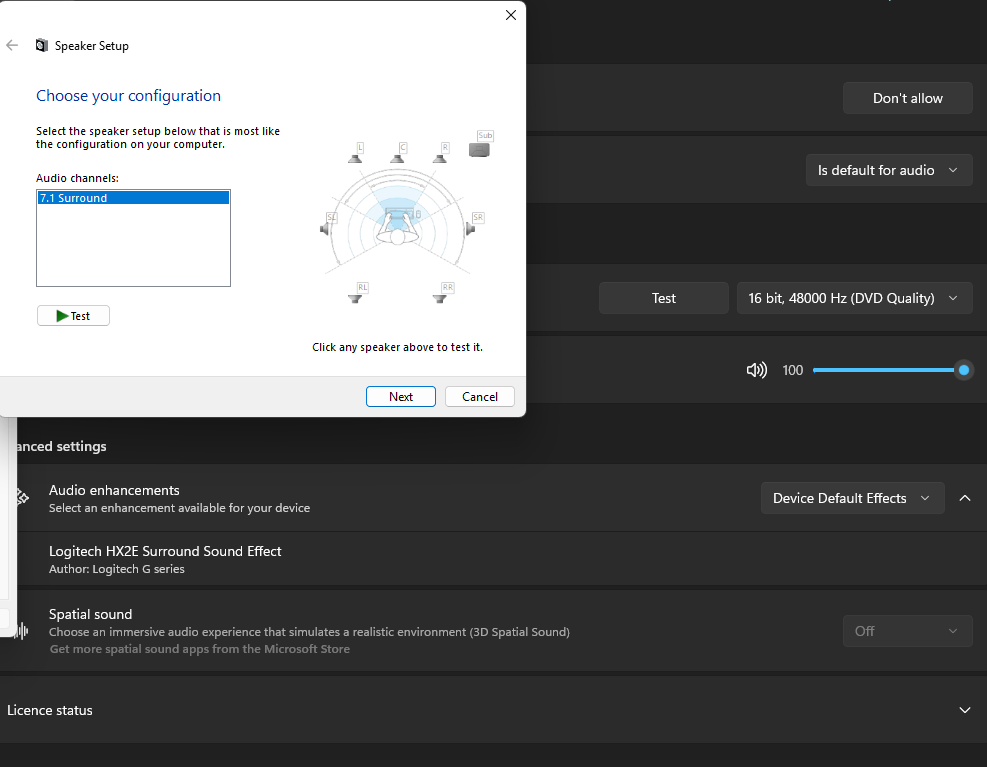
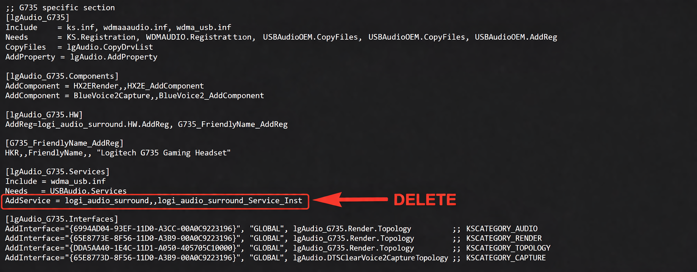
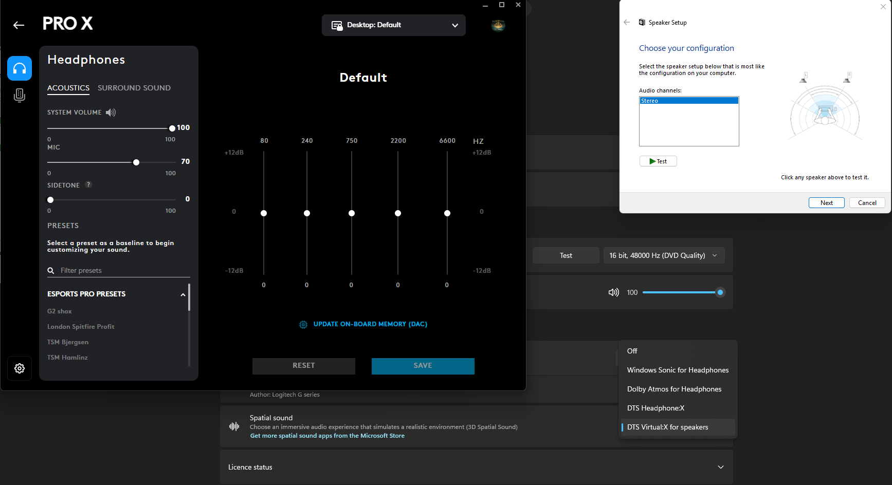

<p align="center">
  <h1 align="center">🎧 Logitech Headset Modded Driver — Restore 2.0 Stereo for Windows Spatial Audio</h1>
</p>

<p align="center">
Most Logitech G headsets (PRO X, G733, G635, etc.) are forced into an 8-channel (7.1) virtual by G HUB Drivers which causes two main issues.
</p>

---

## The Problem

Most Logitech G headsets (PRO X, G733, G635, etc.) are forced into an 8-channel (7.1) virtual by G HUB Drivers which causes two main issues:

1. **Audio Compression:** The sound feels muffled and compressed due to forced APO limiters
2. **Blocked Features:** You cannot enable Dolby Atmos or DTS Sound Unbound because Windows requires a native 2.0 Stereo endpoint

---

## Choose Your Method

There are **two** completely different ways to use this project. Choose the one that suits you:

- **Method 1:** Modify the official Logitech driver yourself by following the complete guide.
- **Method 2:** Download the pre-modified and signed driver and install it directly.

| | Method 1 | Method 2 |
|---|---|---|
| Starting point | Official Logitech driver | Pre-modified, signed driver |
| INF editing required | Yes | No |
| Best for | Users who want to perform the modification themselves | Users who just want it installed |

---

## Method 1 — Modify the Official Driver

This method is based on the original TechPowerUp procedure. You start with the **official** Logitech G HUB driver and perform the INF modification yourself, following the complete guide below.

### The Modification

After extracting the official Logitech G HUB audio driver from my pc, I've implemented a manual INF-level modification that de-couples the hardware from the forced surround engine. This edit strips away the "muffled" virtual 7.1 layer, restoring a high-fidelity 2.0 output while maintaining full Blue VO!CE compatibility.

<p align="center">
  
  <br>
  <sub>Before — original 7.1 Surround configuration</sub>
</p>

Open your `logi_audio.inf` with a text editor and locate your headset's specific section (eg. `; G735 specific section`). Apply these changes:

**1/ Locate the `**_HW**` section of your model and remove the surround registration**

`(Surround + Name): AddReg=logi_audio_surround.HWAddReg, G735_FriendlyName.AddReg` → Just delete the surround part: `AddReg=G735_FriendlyName.AddReg`

**2/ Killing the Surround Service (The Key Step)**

```ini
[lgAudio_G735.Services]
Include = wdma_usb.inf
Needs = USBAudio.Services
AddService = logi_audio_surround,,logi_audio_surround_Service_Inst
```

Remove the following line:

```ini
AddService = logi_audio_surround,,logi_audio_surround_Service_Inst
```

<p align="center">
  
  <br>
  <sub>Removing the surround service registration from the INF</sub>
</p>

*Save the changes and its done for installation*

### Installation Guide

1. **Clean Uninstall:** Go to `Device Manager` → Right-click your headset → `Uninstall Device` → Check `Attempt to remove driver for this device`
2. **Disable Driver Signature Enforcement:** Restart Windows while holding `Shift` → `Troubleshoot` → `Advanced options` → `Startup Settings` → `Restart` → Press `7` or `F7`
3. **Manual Driver Update:**
   - Open `Device Manager`
   - Right-click your headset (or USB Audio Device)
   - `Update Driver` → `Browse my computer` → `Let me pick from a list` → `Have Disk`
   - Point to your modified `logi_audio.inf`
   - Ignore the security warning and click `Yes`

---

## Method 2 — Ready-to-Install Modded Driver

> For users who do not want to manually modify the official driver.

The driver provided by this project is already **modified and signed**. No INF editing is required.

1. 📜 Install the provided public certificate.
2. 💿 Install the pre-modified driver through Device Manager.

The pre-modified driver and public certificate are available through GitHub Releases.

---

## The Result

- **Spatial Sound:** You can now select Dolby Atmos for headphones or DTS Headphone:X directly from Windows settings
- **No more G HUB audio compression:** you get the raw frequency response of the headset
- **Software Compatibility:** G HUB with the latest version still recognizes the device, and Blue VO!CE microphone features remain fully functional

<p align="center">
  
  <br>
  <sub>After — restored 2.0 Stereo configuration and Windows Spatial Audio availability</sub>
</p>

> **Note:** Even after applying this mod, you must go into the G HUB software settings and ensure that **Enable Surround Sound** is unchecked (Off).

---

## Supported Headsets

Logitech G430, G431, G432, G433, G533, G633, G635, G733, G933, G935, PRO X, PRO X Wireless, PRO X 2

---

## Downloads

The ready-to-install modded driver and the public certificate (Method 2) are available through **GitHub Releases** on this repository.

---

## License

This project is provided as-is for personal and educational use. See the [LICENSE](LICENSE) file for details.
